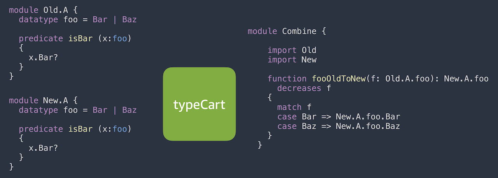
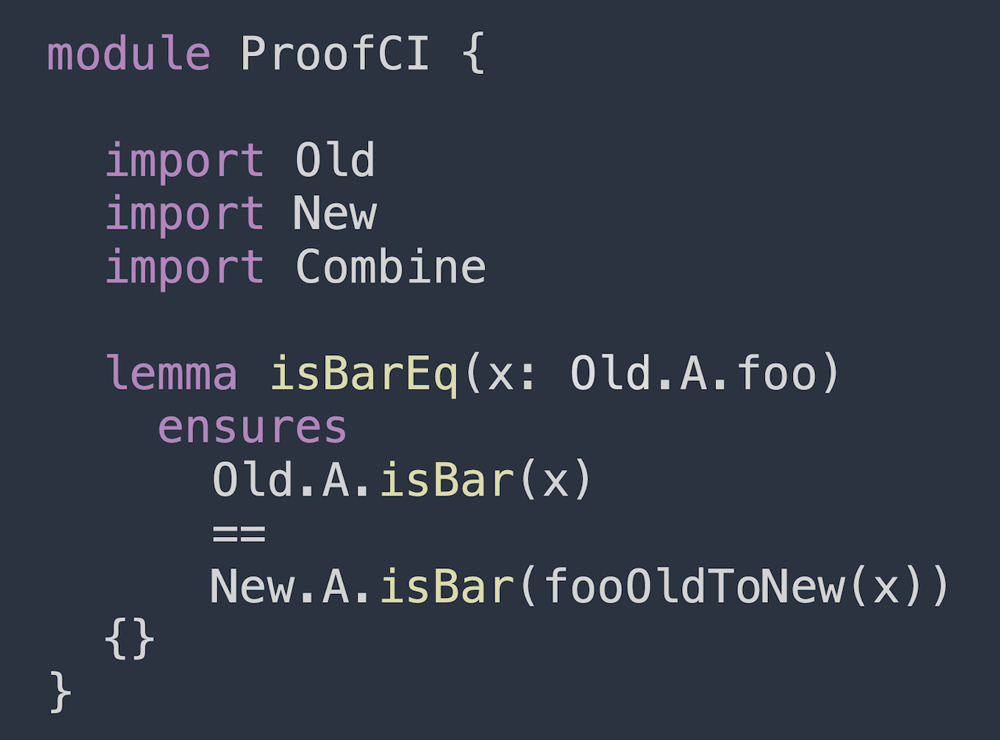

### Example:

Given two identical modules `Old.A` and `New.A` that declare a simple datatype `foo` and a predicate `isBar`, typeCart generates a module `Combine` containing the mapping function `fooOldtoNew`. The function `fooOldtoNew`, as its name describes, converts a value of type `Old.A.foo` to the value of type `New.A.foo`. Please note that typeCart references the types by their top-level full Dafny names to avoid name clashes.

We could then easily reason about two versions of predicate `isBar` as:

